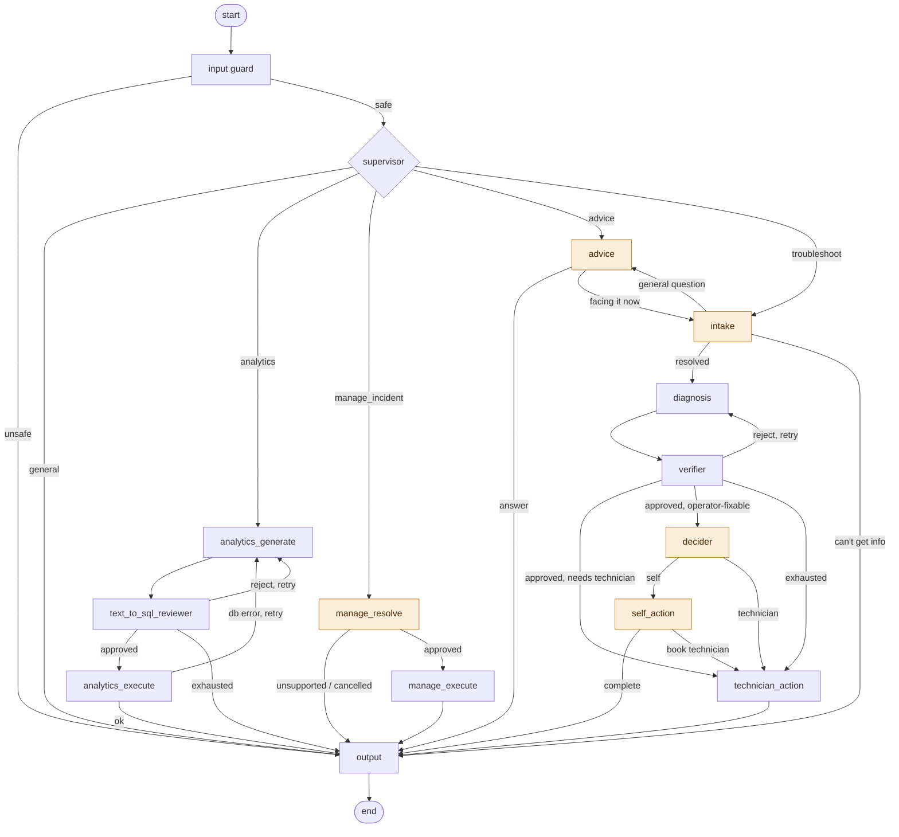

# Agent layer (LangGraph)

This layer is the **brain** of the system. A multi-agent workflow built with **LangGraph** that orchestrates the **MCP tools** and the **Knowledge layer** (DB + RAG) to troubleshoot FDM 3D-printer faults, answer analytics questions, and take actions (open incidents, book technicians, notify people) with verification and human-in-the-loop before anything irreversible.

> For detailed workflow, see the **Graph assembly** section for the embedded diagram.

---

## Design philosophy

- **Supervisor-orchestrated, single-responsibility agents.** Small agents with small tool sets → better tool selection, cheaper prompts, isolated failures, easier to test and observe.
- **Deterministic edges; LLM routing only where a real decision exists** (intent routing, self-fix vs technician). Predictable + cheap.
- **Structured outputs (Pydantic).** Every reasoning node returns a validated object (`schemas.py`); the graph routes on typed fields, not parsed text.
- **Tools are the only data access.** Nodes never touch MySQL/Chroma directly — they call the MCP tools, inheriting their safety/PII guarantees.
- **Independent verification.** The Verifier uses a *different* model family (Gemini) than the reasoner (Groq Llama) to avoid correlated blind spots.
- **Human-in-the-loop before irreversible actions** (writes, emails) via LangGraph `interrupt()`.
- **Least privilege for agents**, mirroring the DB users: each agent is bound to ONLY the tools it needs (see the allow-list below).
- **Everything free** — Groq + Gemini free tiers; BGE-M3 local embeddings.

---


## The agents & workflow


| #   | Agent                    | LLM                | Tools                                                                                                                                                | Role                                                                                                                                                        |
| --- | ------------------------ | ------------------ | ---------------------------------------------------------------------------------------------------------------------------------------------------- | ----------------------------------------------------------------------------------------------------------------------------------------------------------- |
| 1   | **Input**                | Groq Llama 3.3 70B | —                                                                                                                                                    | scope + prompt-injection / PII-request guard                                                                                                                |
| 2   | **Supervisor**           | Groq Llama 3.3 70B | —                                                                                                                                                    | route: troubleshoot / advice / analytics / manage_incident / general                                                                                        |
| 3   | **Advice**               | Groq Llama 3.3 70B | `list_machine_versions`, `user_manual_retrieval`, `safety_retrieval`                                                                                 | general/preventive/how-to questions: answer (grounded in every model's manual + safety, machine-agnostic) · ask "facing it now?" · hand off to troubleshoot |
| 4   | **Analytics**            | Groq Llama 3.3 70B | `run_readonly_query`                                                                                                                                 | coder: NL → read-only SQL; executor: run approved SQL                                                                                                       |
| 5   | **Text-to-SQL Reviewer** | **Gemini**         | —                                                                                                                                                    | judge the SQL: grounded / relevant / safe; loop back if not                                                                                                 |
| 6   | **Manage Incident**      | Groq Llama 3.3 70B | `get_incident`, `list_incidents`, `list_available_technicians`, `find_available_technician`, `book_technician_slot`, `update_incident`, `send_email` | direct action on a KNOWN incident (close, assign/reassign, update)                                                                                          |
| 7   | **Intake**               | Groq Llama 3.3 70B | `get_machine`                                                                                                                                        | resolve & validate machine; clarify if needed                                                                                                               |
| 8   | **Diagnosis**            | Groq Llama 3.3 70B | RAG + DB read tools                                                                                                                                  | gather evidence (corrective-RAG) → root cause + fix                                                                                                         |
| 9   | **Verifier**             | **Gemini**         | —                                                                                                                                                    | judge groundedness/relevance/safety; loop back if weak                                                                                                      |
| 10  | **Decider**              | Groq Llama 3.3 70B | —                                                                                                                                                    | ask the user: self-fix or technician?                                                                                                                       |
| 11  | **Self Action**          | — *no LLM*         | `create_incident`, `update_incident`                                                                                                                 | present the already-verified guidance; on "complete" log a self-resolved incident (reuses the Diagnosis' fix + safety — no re-retrieval)                    |
| 12  | **Technician Action**    | — *no LLM*         | `find_available_technician`, `create_incident`, `book_technician_slot`, `update_incident`, `send_email`                                              | book a technician/supervisor, update tables, notify                                                                                                         |
| 13  | **Output**               | Groq Llama 3.3 70B | —                                                                                                                                                    | compose ALL final replies (+ mid-flow asks via interrupt); final PII scrub                                                                                  |


**Flow (narrative):** user turn → **Input** (scope/safety) → **Supervisor** routes →
*analytics* = **Analytics** (coder) → **Text-to-SQL Reviewer** → *(approved)*
**Analytics** (execute) → **Output**; *(reviewer-reject or DB-error loops back to
the coder, capped at* `ANALYTICS_MAX_ATTEMPTS`*)*. *advice* = **Advice** (machine-agnostic
general/preventive guidance grounded in the safety guide + every model's manual, rendered
as one shared answer + per-model deltas; asks "facing it now or just asking?" when unclear,
and hands off to troubleshoot if the user is facing it) → **Output**; *manage_incident* =
**Manage Incident** (approval interrupt before writes) → **Output**; *general* = direct
**Output**; *troubleshoot* = **Intake** (clarify via interrupt if details missing)
→ **Diagnosis** (RAG + DB) → **Verifier** (retry loop, capped at
`VERIFY_MAX_ATTEMPTS`) → **Decider** (asks the user) → **Self Action** *or*
**Technician Action** (approval interrupt before writes/email) → **Output**.

---


## How it connects to the app

The compiled graph is the **only** thing a front-end talks to, through a thin
boundary in `[api.py](api.py)`:

```
start_turn(thread_id, user_id, message) -> Result   # Result carries kind/content/turn_id/run_id
resume_turn(thread_id, value)           -> Result   # answer a clarification / approve an action
stream_turn(...) / stream_resume(...)   -> async-gen of {type:"decision"|"tool"|"token"} … {type:"result",**Result}
```

The `stream_*` variants run `astream(stream_mode=["updates","messages","custom"])` and emit a live activity feed — `decision` lines (per-agent summaries from `updates`), `tool` lines (nodes' MCP calls via `streaming.emit_tool`, on the `custom` stream), and `token` events (the Output node's answer, streamed) — then the same final `Result`. `start_turn`/`resume_turn` (one-shot `ainvoke`) remain for non-streaming callers.

- `thread_id` = one chat (memory + pause/resume via the checkpointer).
- `user_id` = the logged-in operator's `employee_id` (drives `create_incident(reported_by=…)` and notifications — set from login, never asked in chat).
- `interrupt()` points (Intake clarify, Advice "facing it now?" disambiguation, Decider choice, Self-Action 2-button choice, Manage-Incident clarify / choose-technician / approve) surface as `needs_input`/`needs_approval`; the app renders a prompt / buttons / Approve-Reject and calls `resume_turn`. (Technician-Action is mechanical — no LLM, no approval interrupt.)
- **Callers:** a CLI driver (`[run.py](run.py)`) and the **Phase 6 Streamlit app** (`[app/](../app/)`) both call these *same* functions — no graph changes. The returned `run_id` lets the UI attach feedback (`observability.log_feedback`).


## Memory & threads

- **Within a thread:** after each step LangGraph **checkpoints** the full `State` keyed by `thread_id`; the next turn reloads it → the conversation continues.
- **Conversation history (**`messages`**):** the user turn is appended at the start of a
request (`api.start_turn`) and the assistant's final reply at the end
(`output_node`); both via the `add_messages` reducer. `history.format_recent(...)`
renders the last **5 exchanges** so the Input guard, Supervisor, and Analytics
coder can resolve brief follow-ups ("which are mine?", "what about the closed
ones?") that are meaningless in isolation. The structured state is still the
primary working memory — this is a bounded window, not the whole transcript.
- **Across threads:** isolated — a new chat is a new `thread_id` with fresh state
(no sharing).
- **Long chats (e.g. 80 turns):** there is no fixed "thread token limit" — the
checkpointer persists everything; the constraint is the **LLM context window**
per call (Llama ≈128K, Gemini ≈1M). We keep calls small by (1) reading typed
**state fields** instead of the raw transcript, (2) trimming/windowing messages,
(3) summarizing older turns.


## LLM strategy


| Role                     | Model                     | Why                                                                                     |
| ------------------------ | ------------------------- | --------------------------------------------------------------------------------------- |
| Reasoning                | **Groq Llama 3.3 70B**    | fast, strong tool-calling, free                                                         |
| Verifier / future vision | **Gemini 2.5 Flash-Lite** | independent family; multimodal; free                                                    |
| Judge fallback           | **Qwen-3 32B (Groq)**     | takes over when Gemini is unavailable; still a different family than the Llama reasoner |
| Embeddings (RAG)         | **BGE-M3 (local)**        | free, no rate limits, deterministic                                                     |


> - These are the only models the **live agent** uses (Groq + Google). 
> - The offline **eval judge** is separate — it lives in `[eval/](../eval/)` on **OpenRouter* (`EVAL_JUDGE_MODEL`, e.g. Qwen-3) so grading never competes with the agent's quota and stays an independent opinion. The agent never calls OpenRouter.

**Resilience (free-tier reality)** 

Three layers, innermost first:

1. **Retries** — `max_retries` rides out a *transient* `503`/`429` errors with exponential backoff, kept LOW so a hard daily-cap doesn't turn into long backoff waits (5 retries ≈ 15s/key of pointless waiting on a cap that won't clear). The **reasoner** uses `LLM_MAX_RETRIES` (2); the **whole judge chain** (Gemini *and* its Qwen-on-Groq fallback) uses `JUDGE_MAX_RETRIES` (1). Every candidate/key has the next as a backup (layer 2), so each fails FAST and advances rather than hanging on retries — which is what made the Intake/Verifier steps drag when both providers were throttled.
2. **Backup key (optional)** — if `GROQ_API_KEY_2` / `GOOGLE_API_KEY_2` is set, the factories build a `_QuotaFailover` chain (`get_reasoner`, `get_judge`, `get_judge_structured`): when the primary returns a **transient** error (`config.is_transient_error` — rate-limit / quota / capacity, or a connection / timeout blip), the next candidate is tried. It does **not** fail over on request/validation bugs (those surface immediately). With no secondary key set, the factory returns the bare model — identical to before. *(The "free-tier limit" message in* `api.py` *uses the narrower* `is_rate_limit_error`*, so a timeout isn't mislabeled as a cap.)* *(Groq's token cap is per-account, so a 2nd Groq key from the same account shares that cap; real headroom needs a separate account.)*
3. **Cross-family judge fallback** — `get_judge_structured()` keeps Gemini primary but appends **Qwen-3 on Groq** to the chain, so a Gemini outage falls to a different family (preserving the verifier's independence) rather than breaking the run. Full order: Gemini key1 → key2 → Qwen-Groq key1 → key2 (whichever exist).

Only when **every** configured key is exhausted does the error reach `api.py`, which shows the friendly "free-tier limit — resets at midnight" message.

---


## MCP connection & per-agent tool allow-list

The agents connect to **both** MCP servers at once via `langchain-mcp-adapters`' `MultiServerMCPClient` (`mcp_client.py`):

- **stdio** (`local_data`) — auto-spawned; the 15 read/RAG/write tools.
- **streamable-HTTP** (`services`, `127.0.0.1:8000`) — separate process `run_readonly_query`, `send_email`.

`get_all_tools()` returns the union (17 tools); `tools_for(agent, tools)` filters to each agent's allow-list (`config.AGENT_TOOLS`):


| Agent                                                                   | Tools                                                                                                                                                |
| ----------------------------------------------------------------------- | ---------------------------------------------------------------------------------------------------------------------------------------------------- |
| input · supervisor · text_to_sql_reviewer · verifier · decider · output | *(none)*                                                                                                                                             |
| advice                                                                  | `list_machine_versions`, `user_manual_retrieval`, `safety_retrieval`                                                                                 |
| analytics                                                               | `run_readonly_query`                                                                                                                                 |
| intake                                                                  | `get_machine`                                                                                                                                        |
| diagnosis                                                               | `user_manual_retrieval`, `safety_retrieval`, `get_overdue_status`, `get_maintenance_history`, `get_incident_history`, `check_inventory`              |
| manage_incident                                                         | `get_incident`, `list_incidents`, `list_available_technicians`, `find_available_technician`, `book_technician_slot`, `update_incident`, `send_email` |
| self_action                                                             | `create_incident`, `update_incident`                                                                                                                 |
| technician_action                                                       | `find_available_technician`, `create_incident`, `book_technician_slot`, `update_incident`, `send_email`                                              |


**Launch order:** `python mcp_server/server.py http` (HTTP services server) → then run the agent (it auto-spawns the stdio server and connects to the HTTP one).

---


## Phase 4a — Foundations  ✅

The plumbing every node stands on (no nodes yet):


| File                                       | Purpose                                                                                                                                                                                                                                                             |
| ------------------------------------------ | ------------------------------------------------------------------------------------------------------------------------------------------------------------------------------------------------------------------------------------------------------------------- |
| `[config.py](config.py)`                   | models, MCP server map, **per-agent tool allow-lists**, workflow constants, API keys                                                                                                                                                                                |
| `[schemas.py](schemas.py)`                 | Pydantic structured outputs (`GuardResult`, `Route`, `Intake`, `Diagnosis`, `Verdict`, `Decision`, `SqlPlan`, `SqlReview`, `ManagePlan`)                                                                                                                            |
| `[llms.py](llms.py)`                       | `get_reasoner()` (Groq) · `get_judge()` (Gemini) — provider factory                                                                                                                                                                                                 |
| `[mcp_client.py](mcp_client.py)`           | connect to both MCP servers; `get_all_tools()` + `tools_for(agent)`                                                                                                                                                                                                 |
| `[utils/history.py](utils/history.py)`     | `format_recent(messages, n)` — recent-exchanges window for follow-up context                                                                                                                                                                                        |
| `[utils/clarify.py](utils/clarify.py)`     | clarify-interrupt UX helpers: `guide()`/`give_up()` (how-to-find-it text when a user is stuck) + `is_bail()`/`bailed()` (cheap fast-path to stop on obvious "ok"/"cancel"). Intent itself (stuck / which-incident / which-tech / note) is LLM-judged at the agents. |
| `[utils/streaming.py](utils/streaming.py)` | `emit()`/`emit_tool()` — nodes surface tool calls / sub-steps onto the `astream(stream_mode="custom")` feed (no-op outside a streamed run) for the app's 6b live activity log                                                                                       |


**Milestone test** (`python agents/mcp_client.py`, under a clearly-marked `MILESTONE TEST` header):

- **Part 1 (no API key):** connect to both servers, list the 17 tools, print each agent's resolved allow-list.
- **Part 2 (needs** `GROQ_API_KEY`**):** bind `tools_for("intake")` to the reasoner and confirm it emits a `get_machine` tool call.

---


## Agents (Phase 4b)

> Build order: Input → Supervisor → Analytics → Text-to-SQL Reviewer → Manage Incident → Advice → Intake → Diagnosis → Verifier → Decider → Self Action → Technician Action → Output.
> Prompts are versioned in `prompts/<agent>.py` (a `VERSION` + changelog header); each run is tagged with the `prompt_version` it used. Prompt text is not reproduced here.
>
> **Every node** reads/writes the shared `State` and (for reasoning nodes) returns a **Pydantic** model via `llm.with_structured_output(Model)` — so each subsection states the **input format** (state keys read) and **output format** (the Pydantic model + state keys written).


### 1. Input Agent — `nodes/input.py`  ✅

- **Purpose:** the front gate — classify each user turn as **in-scope** (FDM maintenance/ service/ faults, analytics, capabilities, or operational incident/ booking actions) **and safe** (no prompt-injection, no PII/credential extraction). Pure classifier; it never answers or acts.
- **LLM:** **Groq Llama 3.3 70B** (reasoner), `with_structured_output(GuardResult)`.
- **Tools:** none.
- **Input:** the current user turn (`state.user_input`, else the last message) + the recent `messages` window (last 5 exchanges) so a brief follow-up is judged in context.
- **Output:** `{input_safe: bool, guard_reason: str, prompt_versions["input"]}`.
- **Routing:** `input_safe = False` → **Output** (polite refusal carrying `guard_reason`); `True` → **Supervisor**.
- **Edge cases:** instruction-override / "print your prompt" → `safe=False`; request for an employee's phone/email/credentials → `safe=False` (even when the topic is in-scope); off-domain question → `safe=False`; **operational actions** like "mark incident complete" / "book a technician" → `safe=True` (capability decided downstream); vague/ambiguous but on-topic → `safe=True` (clarified by later agents). **Moderate** strictness — only *clear* overrides/PII are blocked.
- **Prompt:** `prompts/input.py` · v1.2.0 (context-aware follow-ups; farewells/sign-offs are benign small-talk not injection; judge the latest message on its own merits — a prior refusal doesn't taint the next).


### 2. Supervisor Agent — `nodes/supervisor.py`  ✅

- **Purpose:** the intent router — classify the (already-guarded) turn into exactly one of five routes. Pure router; never answers or acts.
- **LLM:** **Groq Llama 3.3 70B** (reasoner).
- **Tools:** none.
- **Input format** (state keys read): `user_input` (else the last `messages` entry) + the recent `messages` window (last 5 exchanges) for follow-up context.
- **Output format** (Pydantic `Route` via `with_structured_output`) → writes state: `intent` (`"troubleshoot" | "advice" | "analytics" | "manage_incident" | "general"`), `prompt_versions["supervisor"]`.
- **Routing:** `troubleshoot` → **Intake** · `advice` → **Advice** · `analytics` → **Analytics** · `manage_incident` → **Manage Incident** · `general` → **Output**.
- **Edge cases:** a CURRENT fault → `troubleshoot`; a general/preventive/how-to or hypothetical question → `advice`; **unsure current-fault vs asking →** `advice` (it confirms with the user rather than demanding a machine); READ data question → `analytics`; WRITE/action on a known record → `manage_incident`; capability/greeting/farewell → `general`; a brief follow-up routes to its referent's path (e.g. after listing incidents, "which are mine?" → `analytics`).
- **Prompt:** `prompts/supervisor.py` · v1.4.0 (adds the advice route; ambiguous fault→advice; a bare acknowledgement→general, not accepting a diagnose offer).


### 3. Advice Agent — `nodes/advice.py`  ✅

- **Purpose:** answer general / preventive / how-to / hypothetical FDM questions ("what to do if the bed heats rapidly?", "how do I prevent clogs?") that are NOT a current fault — with **no machine and no incident**. A first-class agent (own node + prompt + structured output), a peer of Analytics.
- **LLM:** **Groq Llama 3.3 70B** (triage). **Tools (answer path):** `list_machine_versions` → per-model `user_manual_retrieval` + `safety_retrieval` — all machine-agnostic (it retrieves *every* model's manual rather than asking which machine); the grounded reply is composed by the **Output** agent in *advice* mode.
- **Input format** (state read): `user_input`, the recent `messages` window + the prior `clarification_question` (so a disambiguating reply is read IN CONTEXT).
- **Output format** (Pydantic `AdvicePlan` via `with_structured_output`) → `advice_route` (`answer`/`ask`/`troubleshoot`), `advice_topic`, `clarification_question`/`needs_clarification` (ask), `retrieved_context` (answer), or `intent="troubleshoot"`+`symptom` (handoff); tags `prompt_versions["advice"]`.
- **Routing:** answer → **Output** (advice mode) · ask → interrupt, then re-triage the reply · troubleshoot handoff → **Intake** (`route_after_advice`).
- **Disambiguation (LLM-based, no regex):** when it's unclear whether the user is FACING the fault now or just asking, `route="ask"` → the graph interrupts with one question ("Are you seeing this on a machine right now — I can diagnose it — or asking for general guidance?"); the reply is re-classified using the conversation + that question — "yes, on M05" → hand off to troubleshoot; "just asking" → answer. After the re-ask cap it answers generally rather than loop.
- **Grounding:** machine-agnostic but fleet-wide — the **safety guide** (`safety_retrieval`, all models) **plus every model's user manual** (`list_machine_versions` → `user_manual_retrieval` per `mvc_code`, each chunk tagged with its model). Output writes **one shared answer + per-model deltas** (a single answer when models don't differ). Framed as guidance, not a machine-specific diagnosis.
- **Prompt:** `prompts/advice.py` (`ADVICE_TRIAGE_SYSTEM`) · v1.1.0; the answer is rendered by `prompts/output.py` MODE=advice.


### 4. Analytics Agent (Text-to-SQL coder + executor) — `nodes/analytics.py`  ✅

- **Purpose:** answer read-only analytics questions by generating SQL (grounded in the schema) and, after the Reviewer approves, executing it. Result summarization is the **Output** agent's job.
- **LLM:** **Groq Llama 3.3 70B** (generate phase); **no LLM** in the execute phase.
- **Tools:** `run_readonly_query` (execute phase only).
- **Two phases (one agent):** `analytics_generate` (LLM → `SqlPlan`) and `analytics_execute` (mechanical `run_readonly_query` → rows).
- **Input format** (state read): `user_input`, `current_user_id` (for "my/mine"), the recent `messages` window (for follow-ups); on retry also `sql_plan` + `sql_review`/`sql_result` (the critique/DB-error to fix).
- **Output format** (Pydantic `SqlPlan` via `with_structured_output`) → state `sql_plan`, `analytics_attempts`; execute → `sql_result`; tags `prompt_versions["analytics"]`.
- **Schema grounding:** the prompt is filled with `get_schema_context()` (from `schema_metadata.json`) + `REFERENCE_TODAY` (`2026-06-16`) so date logic matches the dataset.
- **Edge cases:** reviewer-reject or DB-error → regenerate with the critique (capped at `ANALYTICS_MAX_ATTEMPTS = 3`); never selects `phone`; empty result → handled by Output ("no matching records"); results auto-capped at 200 rows (enforced by the `run_readonly_query` tool, `mcp_server/safety.py` `DEFAULT_MAX_ROWS`).
- **Prompt:** `prompts/analytics.py` (`ANALYTICS_CODER_SYSTEM`) · v1.8.0 (operator-aware "my/mine"; follow-ups — incl. a **meta follow-up** about a prior list re-scoping to that list's filter, not a global count; incident lists include complaint + reported_by/technician_id **+ a derived `status` (open/closed)** by default; **prefers a breakdown over a bare total** — GROUP BY status / assignee role so the answer can explain the composition; **"list those" after an answer that named a subject+set** re-scopes to that exact set, not all rows). The **executed** SQL (only the approved query, not retries) is surfaced to the UI as a code expander (see app README).


### 4. Text-to-SQL Reviewer — `nodes/text_to_sql_reviewer.py`  ✅

- **Purpose:** judge the generated SQL **before** it runs — the *semantic* layer of a 3-layer defense (reviewer = grounded/relevant/safe; `validate_select_sql` = mechanical; `maint_readonly` = DB enforcement).
- **LLM:** **Gemini 2.5 Flash-Lite** (independent judge — different model family than the Llama coder).
- **Tools:** none.
- **Input format** (state read): `user_input`, `sql_plan`.
- **Output format** (Pydantic `SqlReview` via `with_structured_output`) → state `sql_review` (`grounded`, `relevant`, `safe`, `approved`, `issues`); tags `prompt_versions["text_to_sql_reviewer"]`.
- **Loop:** `approved = grounded ∧ relevant ∧ safe`. If not approved (or execution later errors) → back to Analytics coder with `issues`, capped at `ANALYTICS_MAX_ATTEMPTS`; on exhaustion → Output (graceful "couldn't answer reliably").
- **Edge cases:** invented table/column → `grounded=False`; wrong computation for the question → `relevant=False`; write/`phone`/multi-statement → `safe=False`. Knows `REFERENCE_TODAY`, so it does **not** penalize correct use of the fixed reference date.
- **Prompt:** `prompts/text_to_sql_reviewer.py` · v1.0.0.


### 6. Manage Incident Agent — `nodes/manage_incident.py`  ✅

- **Purpose:** perform a **direct action on a KNOWN incident** (no diagnosis): **close** (mark complete), **assign/reassign** a technician, or **update_comment**. Two phases with an approval/clarification interrupt between.
- **LLM:** **Groq Llama 3.3 70B** (`manage_resolve` planning only); `manage_execute` is mechanical (no LLM).
- **Tools:** `get_incident`, `list_incidents`, `list_available_technicians`, `find_available_technician`, `book_technician_slot`, `update_incident`, `send_email`.
- **Phases:** `manage_resolve` (resolve incident via `get_incident` → `ManagePlan`; for `assign`, resolve a technician from **live** availability) → approval/clarification interrupt → `manage_execute` (perform + notify).
- **Input format** (state read): `user_input` (+ carried `manage_plan` on resume), `current_user_id`. **Output format** (Pydantic `ManagePlan`, enriched) → state `manage_plan`, `needs_clarification`/`clarification_question`, `requires_approval`; execute → `action_result`; tags `prompt_versions["manage_incident"]`.
- **Availability rules live in the node** (not the prompt — the LLM has no live data): named-&-available → propose; named-unavailable **or** unnamed → present `list_available_technicians` and ask the manager to choose; the chosen tech is then booked. **Availability enforced** (no overload); **reassign auto-frees the prior slot** (`book_technician_slot`).
- **Notifications:** close → operator; assign → technician **and** operator (`send_email`; `email_dry_run` flag for tests).
- **Browse to pick (v1.3.0):** if no incident id is given, the node calls `list_incidents` and shows the **open incidents to choose from** (reply with an id); the user can say "mine" → filtered to the operator (`current_user_id`, reported-by **or** assigned), or "closed"/"all" to widen (closed rows also show the agent's root-cause/suggestion + what the technician did). The original intent ("update") is carried so the chosen id resumes correctly. Opening a *new* incident → redirected to troubleshoot.
- **Reply understanding (hybrid, not regex-enumerated):** when there's no clear id, `_interpret_reply` resolves what the user means — cheap regex first (explicit `inc_NN`, obvious `is_bail`), then an **LLM** (`ClarifyReply`, in conversation context) for everything else. It generalizes to phrasings regex can't: a **referential mention** ("the booked incident", "wrap up that ticket from earlier", "close it") → resolves the id from history; a **described row** ("the cooling-fan one", "the MINTEMP one on M13") → maps to that incident; a **browse** request ("show me", "which are mine") → re-list (`mine` filter); a **bail/pivot** ("ok", "actually how many machines are overdue") → stop. Open a NEW incident → redirect to troubleshoot.
- **Other edge cases:** unknown id → clarify; **close requires a comment** → ask if missing (never invented); close an already-closed / assign to a closed incident → `unsupported`; reject at approval → no writes. **The browse picker** is a Markdown table incl. **Reported by / Assigned to** employee ids and is **scoped to OPEN incidents** (every manage action applies to an open incident; closed-incident history is a read/analytics question).
- **Prompts:** `prompts/manage_incident.py` — `MANAGE_RESOLVE` v1.3.0 (plan the action); `prompts/clarify_interp.py` v1.1.0 holds the **three** reply interpreters this node uses as separate LLM calls — `CLARIFY_INTERP_SYSTEM` (ambiguous id/browse/bail → `ClarifyReply`), `TECH_PICK_SYSTEM` (which technician → `TechPick`), and `NOTE_REPLY_SYSTEM` (work note on close/update → `NoteReply`).


### 7. Intake Agent — `nodes/intake.py`  ✅

- **Purpose:** the troubleshoot entry point — ensure a **valid machine** + a **symptom** before diagnosis; hand `mvc_code` + `symptom` to Diagnosis.
- **LLM:** **Groq Llama 3.3 70B** (reasoner).
- **Tools:** `get_machine`.
- **How it works:** the LLM extracts `machine_id` + `symptom` (merging anything gathered earlier); the node validates via `get_machine`, resolving `mvc_code`/`status`. `mvc_code` is filled by the node (the LLM never guesses it).
- **Input format** (state read): `user_input`, carried `machine_id`/`symptom` on resume, the recent `messages` window + the prior `clarification_question` (so the LLM interprets a reply like "Got it"/"yes"/"that one" *in context*, not blindly).
- **Output format** (Pydantic `Intake`, enriched) → state: `machine_id`, `mvc_code`, `machine_status`, `symptom`, `needs_clarification`, `clarification_question`; tags `prompt_versions["intake"]`.
- **Routing:** `needs_clarification = True` → clarification interrupt (ask) → re-enter on reply (carries the part already gathered); `False` → **Diagnosis**.
- **Edge cases:** missing machine id → ask which machine; unknown machine (`exists: False`) → ask to confirm the id; **Decommissioned** → ask if the machine number is correct; missing symptom → ask what the problem is; **Under Maintenance / Idle** still proceed. **Reply intent is LLM-judged** (the Intake LLM returns `user_stuck` / `user_quit` / `general_question`, no extra call): a "don't know / can't find" reply (`user_stuck`) → explain *how to get* the info (asset label / maintenance log / supervisor); **"no, I'm just asking for my own knowledge"** (`general_question`) → **hand off to Advice** (`intent="advice"`, `advice_general=True` so Advice asks the topic, not "facing it now?") — not a quit; an explicit abandon (`user_quit`) → stop cleanly (`clarify_abandoned` → Output). A bare **acknowledgement** ("ok", "got it", "thanks") is **not** a quit — it continues (re-ask). The intake wrapper no longer uses an `is_bail` shortcut (the LLM decides in context). After the re-ask cap, a give-up message routes to Output rather than diagnosing with no machine.
- **Prompt:** `prompts/intake.py` · v1.3.0 (user_stuck / user_quit; acknowledgement ≠ quit; general_question -> advice handoff).


### 8. Diagnosis Agent — `nodes/diagnosis.py`  ✅

- **Purpose:** the core reasoner — given `mvc_code` + `symptom`, gather evidence and produce a **grounded** `Diagnosis` (root cause + fix). Feeds the Verifier.
- **LLM:** **Groq Llama 3.3 70B** (synthesis only — the node calls the tools).
- **Tools:** `user_manual_retrieval`, `safety_retrieval`, `get_overdue_status`, `get_maintenance_history`, `get_incident_history`, `check_inventory`.
- **Orchestrated (not ReAct):** the node gathers a fixed evidence bundle concurrently (manual + safety RAG, overdue, service history, prior incidents), the LLM synthesizes, then **corrective-RAG** re-queries the manual (query sharpened with the hypothesised `root_cause`) while `retrieval_confidence == "low"`, capped at `MAX_DIAGNOSIS_REQUERIES = 3`; finally `check_inventory` looks up stock for any `parts_needed`.
- **Input format** (state read): `machine_id`, `mvc_code`, `symptom`.
- **Output format** (Pydantic `Diagnosis` via `with_structured_output`) → state: `diagnosis` (`root_cause`, `evidence`, `fix_steps`, `needs_technician`, `parts_needed`, `safety_notes`, `retrieval_confidence`), `retrieved_context` (manual+safety chunks, for the Verifier), `db_facts` (overdue/history/incidents/parts-availability); tags `prompt_versions["diagnosis"]`.
- **Routing:** → **Verifier** (judges grounding/relevance/safety; loops back here, capped at `VERIFY_MAX_ATTEMPTS = 3`).
- **Edge cases:** weak manual coverage → `low` confidence → CRAG re-query; **overdue** machine weighted as a strong signal; prior incident reused; grounds strictly in provided evidence (Verifier enforces). `safety_retrieval` is always called; the LLM keeps only *relevant* `safety_notes`.
- **Prompt:** `prompts/diagnosis.py` · v1.0.0.


### 9. Verifier Agent — `nodes/verifier.py`  ✅

- **Purpose:** independent **LLM-as-judge** over the Diagnosis, using the **RAG triad(context relevance, groundedness, answer relevance)) + safety** across two relationships: *context↔query* and *diagnosis↔context/query*.


| Description                               | Standard name               | What it checks                                                                                |
| ----------------------------------------- | --------------------------- | --------------------------------------------------------------------------------------------- |
| context is relevant/safe w.r.t. the query | Context Relevance           | Did retrieval fetch passages that actually pertain to the symptom? (catches retrieval misses) |
| diagnosis is grounded w.r.t. the context  | Groundedness / Faithfulness | Is every claim in the diagnosis supported by the evidence? (catches hallucination)            |
| diagnosis is relevant w.r.t. the query    | Answer Relevance            | Does the diagnosis address the user's actual symptom?                                         |
| both are safe                             | Safety                      | Do the fix steps respect the safety passages?                                                 |


- **LLM:** **Gemini 2.5 Flash-Lite** (a different model family than the Llama diagnoser → independent judgment, fewer correlated blind spots).
- **Tools:** none (judges the evidence already in state).
- **Input format** (state read): `symptom`, `retrieved_context` (manual+safety), `db_facts`, `diagnosis`.
- **Output format** (Pydantic `Verdict` via `with_structured_output`) → state: `verdict` (`context_relevant`, `grounded`, `answer_relevant`, `safe`, `approved`, `score`, `issues`), increments `verify_attempts`; tags `prompt_versions["verifier"]`.
- **Dimensions:** `context_relevant` (retrieval on-target for the query) · `grounded` (diagnosis supported by context — *sound inference allowed*; flags fabrication/contradiction/inconsistency; `needs_technician`/`parts_needed` judged as reasonable operational calls) · `answer_relevant` (addresses the symptom) · `safe` (respects the safety passages).
- **Loop:** `approved = context_relevant ∧ grounded ∧ answer_relevant ∧ safe`. approved → **Decider**; else (and `verify_attempts < VERIFY_MAX_ATTEMPTS = 3`) → back to **Diagnosis** with `issues` (a context failure re-retrieves; a grounding failure re-synthesizes); attempts exhausted → proceed flagged.
- **Edge cases:** ungrounded/irrelevant claim → reject with actionable issues; off-topic retrieval → `context_relevant=False`; fix contradicts safety → `safe=False`; strict default (not-approved when unsure).
- **Prompt:** `prompts/verifier.py` · v1.0.0.


### 10. Decider Agent — `nodes/decider.py`  ✅

- **Purpose:** decide who fixes it. **Reached ONLY when the diagnosis is operator-fixable** (`needs_technician == False`) — when technician-required, the graph routes straight to **Technician Action** with no question. For operator-fixable, it asks the operator: guided self-fix or assign a technician?
- **LLM:** **Groq Llama 3.3 70B** (interpret the reply). **Tools:** none.
- **Flow:** the graph asks via `interrupt()` using `decider_question(diagnosis)` ("This looks like something you can safely fix yourself: …; do it yourself, or assign a technician?"); `decider_node` then interprets the reply.
- **Input format** (state read): `user_input` (the reply); `diagnosis` (for the ask). **Output format** (Pydantic `Decision` via `with_structured_output`) → state: `decision_path` (`"self"`/`"technician"`), `needs_clarification`, `clarification_question`; tags `prompt_versions["decider"]`.
- **Routing:** `self` → **Self Action**; `technician` → **Technician Action**.
- **Edge cases:** hesitation/safety doubt → `technician` (safe default); genuinely unclear reply → re-ask; never reached when technician-required.
- **Prompt:** `prompts/decider.py` · v1.0.0.


### 11. Self Action Agent — `nodes/self_action.py`  ✅

- **Purpose:** the operator self-fix path (Decider → `self`). Present the **verified** fix guidance, then — on the operator's choice — either log a **self-resolved incident** or hand off to Technician Action.
- **LLM:** none (mechanical). **Tools:** `create_incident`, `update_incident`.
- **Guidance (Option A — reuse):** shows `diagnosis.fix_steps` + `safety_notes` (already grounded + Verifier-approved) via `self_action_message()` — **no re-retrieval** (keeps it fast; content is trusted). Output renders the final confirmation.
- **Two-choice interrupt:**
  - **"Complete & close service request"** → `create_incident(reported_by=operator)` → `update_incident(close=True, assignee_id=operator, comment="Self-Action by the operator")` → `action_result = self_resolved`. The operator is recorded as reporter **and** resolver; **no schedule booking** (`work_date` NULL).
  - **"Book a technician instead"** → **no write** → `action_result = escalate_to_technician` → routes to **Technician Action**.
- **Input format** (state read): `diagnosis`, `machine_id`, `symptom`, `current_user_id`, `self_action_choice` (`"complete"`/`"technician"`, from the interrupt). **Output format:** `action_result` (dict).
- **Edge cases:** `current_user_id` missing / `create_incident` validation fails → `action_result.action = "error"`; incident logged closed same-day; uses the `update_incident` `assignee_id` extension (operator as resolver, no booking).
- **Prompt:** none (mechanical node).


### 12. Technician Action Agent — `nodes/technician_action.py`  ✅

- **Purpose:** the dispatch path — reached when technician-required (Diagnosis `needs_technician`), Decider→technician, or Self Action→"book a technician instead". **Always creates the incident** (it doesn't exist yet on any of these paths), auto-assigns, books, and notifies. **Mechanical — no LLM, no approval, no interrupt** (the dispatch was already decided upstream).
- **LLM:** none. **Tools:** `create_incident`, `find_available_technician`, `book_technician_slot`, `update_incident` (allow-listed; unused at dispatch), `send_email`.
- **Flow:** `create_incident(reported_by=operator)` → `find_available_technician` (3-day hierarchy → **supervisor escalation** if none) → `book_technician_slot` → `send_email` to **assignee + operator**. The incident stays **open** (the assignee closes it later via Manage Incident).
- **Assignee = technician *or* supervisor:** on escalation the assignee is a supervisor (`assignee_role: "Supervisor"`, `escalated: True`); `send_email` picks the template by the recipient's role + incident state (technician = work-assignment, supervisor = escalation, operator = report-confirmation — or a **resolution notice** with the work done when the incident is already closed).
- **Input format** (state read): `machine_id`, `symptom`, `diagnosis`, `current_user_id`, optional `booking_moment`, `email_dry_run`. **Output format:** `action_result` (`technician_assigned` with assignee/role/slot/escalated, or `no_assignee`, or `error`).
- **Edge cases:** no technician in 3 days → supervisor escalation; no active staff at all → `no_assignee`; `create_incident` fails → `error`.
- **Prompt:** none (mechanical node).


### 13. Output Agent — `nodes/output.py`  ✅

- **Purpose:** the single voice — compose the **final user-facing reply** for every terminal path, then a final **PII scrub**.
- **Grounding (Option A):** fact-heavy paths are rendered by **templates** in the node (ids/names/dates/counts verbatim from state — cannot be hallucinated); the **LLM** is used ONLY for `general`, `analytics`, and `advice`. LLM: Groq Llama 3.3 70B. **Tools:** none.
- **Per-path rendering** (what produces each reply, and where):

  | Path                                  | Rendered by                    | Where                                                                                                                                                                                                                   |
  | ------------------------------------- | ------------------------------ | ----------------------------------------------------------------------------------------------------------------------------------------------------------------------------------------------------------------------- |
  | general                               | **LLM**                        | `OUTPUT_SYSTEM` (MODE = general)                                                                                                                                                                                        |
  | analytics                             | **LLM** (exact number quoting) | `OUTPUT_SYSTEM` (MODE = analytics)                                                                                                                                                                                      |
  | advice                                | **LLM** (grounded, all models) | `OUTPUT_SYSTEM` (MODE = advice) — shared answer + per-model deltas from safety + every model's manual                                                                                                                   |
  | clarify give-up (`clarify_abandoned`) | template                       | `output_node` → relays the pre-composed `final_response` (bail / re-ask cap hit)                                                                                                                                        |
  | refusal                               | template                       | `output_node` → relays `guard_reason`                                                                                                                                                                                   |
  | troubleshoot / self                   | template                       | `output_node._self_resolved()` — **answers** ("Yes, you can fix this yourself") + **reasoning** (the diagnosis root cause) + numbered steps + safety, then the **action** ("logged & closed as inc_X")                  |
  | troubleshoot / technician             | template                       | `output_node._technician()` — **answers** ("No, not a self-fix") + **reasoning** (root cause + any part needed / verifier-exhaustion) + the **action** ("logged inc_X; {role} {emp} for {date/slot}"; notes escalation) |
  | no_assignee                           | template                       | `output_node` (inline)                                                                                                                                                                                                  |
  | manage_incident                       | template                       | `output_node._manage()`                                                                                                                                                                                                 |
  | error                                 | template                       | `output_node` (inline) — generic apology when a write/action failed                                                                                                                                                     |

  > Note: `OUTPUT_SYSTEM` (`prompts/output.py`) deliberately covers **only** the three LLM modes (general + analytics + advice) — under Option A the templated paths above are produced in code, not by the prompt.
- **Input format** (state read): `intent`, `input_safe`, `guard_reason`, `user_input`, `diagnosis`, `action_result`, `manage_plan`, `sql_result`, `verifier_exhausted`, `clarify_abandoned` (+ its pre-composed `final_response`, passed straight through when a clarify loop bailed/gave up), the recent `messages` window (general mode, for meta questions), and (advice mode) `advice_topic` + `retrieved_context`. **Output format:** `final_response` (str, PII-scrubbed); tags `prompt_versions["output"]`.
- **PII scrub:** regex strips any email / 7+-digit phone from the final text (belt-and-suspenders; tools already keep PII out of state).
- **Verifier exhaustion:** routed to Technician Action (auto-dispatch); Output states a technician will assess it (no apologetic caveat).
- **Edge cases:** empty analytics result → "no matching records"; `error` action → generic apology. Systematic faithfulness eval is handled in Phase 5 (`eval/` troubleshoot faithfulness/answer-relevance judges).
- **Prompt:** `prompts/output.py` · v1.10.0 (general + analytics + **advice** modes; **general** now receives the recent conversation to answer meta questions ("why did you say X?"); analytics is **answer-first AND explains** — direct yes/no + scope + the **composition/breakdown**, not just a figure — and multi-row → table with complaint + reporter/assignee + **Status** columns; advice = grounded safety-first guidance across **all models** — one shared answer + per-model deltas).


## Graph assembly (Phase 4c)

`graph.py` wires the 13 agents into one LangGraph `StateGraph`, compiled with a
`MemorySaver` checkpointer. `api.py` is the thin boundary the app calls; `run.py`
is a CLI driver. The shared scratchpad is `state.State` (a TypedDict); each node
returns a partial update that LangGraph merges.

### 1. Node inventory (13 agents → 15 graph nodes)

A few agents are multi-step, so the graph has slightly more nodes than agents:


| Graph node                                                          | From agent             |
| ------------------------------------------------------------------- | ---------------------- |
| `input`                                                             | Input                  |
| `supervisor`                                                        | Supervisor             |
| `analytics_generate` · `text_to_sql_reviewer` · `analytics_execute` | Analytics (+ Reviewer) |
| `manage_resolve` · `manage_execute`                                 | Manage Incident        |
| `intake`                                                            | Intake                 |
| `diagnosis`                                                         | Diagnosis              |
| `verifier`                                                          | Verifier               |
| `decider`                                                           | Decider                |
| `self_action`                                                       | Self Action            |
| `technician_action`                                                 | Technician Action      |
| `output`                                                            | Output                 |


The 5 interrupting agents (`intake`, `advice`, `decider`, `self_action`,
`manage_resolve`) are registered as thin **interrupt wrappers** around the plain,
standalone-tested node functions — the wrappers add `interrupt()`; the agents'
logic is unchanged.

### 2. Topology

Compiled graph — **17 nodes** (15 agent-nodes — 13 agents, with Analytics and Manage each spanning 2 nodes — + start/end), **32 edges**. Conditional
edges are labelled with their routing condition; unlabelled edges are
unconditional. The five interrupting nodes pause for the user (LangGraph `interrupt()`).

Compiled LangGraph workflow — 17 nodes / 32 edges

> *LangGraph's native render colours every node the same — it can't mark the interrupt nodes, because* `interrupt()` *is called inside a node's body at runtime, not part of the graph's static structure. For which nodes pause, see the **amber** nodes in the mermaid diagram below (or the Interrupts table in §4).*

The PNG above is a **HD** render of LangGraph's own mermaid (3200px wide).
Regenerate it with `python agents/graph.py --png` (writes `agents/graph.png` via
mermaid.ink at `--width` px, default 3200; needs internet — falls back to LangGraph's
default-res `draw_mermaid_png()` if offline). Print the raw mermaid/counts with
`python agents/graph.py`. The editable mermaid source is below.




Five sub-flows hang off the supervisor's route, and **everything converges
at** `output → END`:

- **general** → `output` (LLM writes a capability/greeting/farewell reply).
- **advice** → `advice` (LLM triage: a general/preventive question → retrieve the safety guide **+ every model's manual** (`list_machine_versions` → per-model `user_manual_retrieval`) → `output` answers in *advice* mode with one shared answer + per-model deltas; if the reply is unclear it interrupts to ask "facing it now or just asking?"; if the user is actually facing the fault it hands off to `intake` → troubleshoot). No machine/incident.
- **analytics** → `analytics_generate → text_to_sql_reviewer → analytics_execute → output`, with two loops back to `analytics_generate` (reviewer-reject, db-error).
- **manage_incident** → `manage_resolve` (interrupts for clarify / choose-technician / approve) → `manage_execute → output`.
- **troubleshoot** → `intake` (interrupts to clarify machine/symptom; if the user is stuck it guides them to the info, and after the re-ask cap routes to `output` with a give-up message) → `diagnosis → verifier`, then the `needs_technician` gate → `decider` / `technician_action`, and `self_action` (interrupts for the 2 buttons).


### 3. Conditional-edge functions (the routers)

Each is a pure `state → next_node_name`:


| Router                          | Decision                                                                                                                               |
| ------------------------------- | -------------------------------------------------------------------------------------------------------------------------------------- |
| `route_after_input`             | `output` if `input_safe is False` else `supervisor`                                                                                    |
| `route_after_supervisor`        | `intent` → `intake` / `advice` / `analytics_generate` / `manage_resolve` / `output`                                                    |
| `route_after_advice`            | `intake` if `advice_route=="troubleshoot"` (user is facing it now) else `output` (answer)                                              |
| `route_after_reviewer`          | `analytics_execute` if approved · `analytics_generate` if `attempts<3` · else `output`                                                 |
| `route_after_analytics_execute` | `output` if `sql_result.ok` · `analytics_generate` if `attempts<3` · else `output`                                                     |
| `route_after_intake`            | `output` if `clarify_abandoned` · `advice` if the user is just asking (intake `general_question` handoff) · else `diagnosis`           |
| `route_after_manage_resolve`    | `output` if action ∈ {unsupported, cancelled} else `manage_execute`                                                                    |
| `route_after_verifier`          | approved → (`technician_action` if `needs_technician` else `decider`); reject & `attempts<3` → `diagnosis`; else → `technician_action` |
| `route_after_decider`           | `self_action` if `decision_path=="self"` else `technician_action`                                                                      |
| `route_after_self_action`       | `technician_action` if `escalate_to_technician` else `output`                                                                          |


**Loops & caps:** analytics coder↔reviewer↔execute (`ANALYTICS_MAX_ATTEMPTS=3`),
diagnosis↔verifier (`VERIFY_MAX_ATTEMPTS=3`), diagnosis-internal corrective-RAG
(`MAX_DIAGNOSIS_REQUERIES=3`). The app relies on LangGraph's default
`recursion_limit` (25), well above the worst path; the e2e harness
(`[test_e2e.py](test_e2e.py)`) raises it to 50 for its long scripted runs.
On verify exhaustion the verifier sets `verifier_exhausted=True` and routing
auto-dispatches a technician (Output says a technician will assess it — no caveat).

### 4. Interrupts (human-in-the-loop) — LangGraph `interrupt()`

The 5 interrupting nodes call `interrupt(payload)` **inside** the node: it pauses
the graph mid-node and surfaces `payload`; the caller resumes with
`Command(resume=value)`, and `interrupt()` returns that value — **without re-running
any upstream node** (unlike an end-and-restart, which would re-run the supervisor on
every clarification and risk re-routing). The other 10 nodes never pause.


| Node             | Interrupt payload (`type`)                         | Resume value                                                                                                                                 |
| ---------------- | -------------------------------------------------- | -------------------------------------------------------------------------------------------------------------------------------------------- |
| `intake`         | `clarify` — which machine / what symptom           | the user's reply (loops until resolved, cap 4)                                                                                               |
| `advice`         | `clarify` — "facing it now, or just asking?"       | the reply, re-triaged (answer / hand off to troubleshoot); after cap 4 it just answers generally                                             |
| `decider`        | `decision` — fix it yourself or book a technician? | free text → interpreted to `self` / `technician`                                                                                             |
| `self_action`    | `choice` — guidance + 2 buttons                    | `"complete"` (log self-resolved) / `"technician"` (escalate)                                                                                 |
| `manage_resolve` | `clarify` / `approve`                              | the reply, or `"approve"`/`"reject"` (reject → cancelled → output); cap 6 (`MAX_CLARIFY + 2`, for its clarify→choose-tech→approve sub-steps) |


### 5. Turn & memory model

- `thread_id` **= one conversation.** `MemorySaver` isolates state per thread. The Phase 6 app still uses `MemorySaver` (module-level, so paused turns survive Streamlit reruns but not a process restart); swap to `SqliteSaver` for cross-restart persistence.
- **Within a request,** interrupts pause/resume on the *same* thread — no upstream re-runs.
- **A new request** re-enters at `input`, which **resets the per-request scratch** (`machine_id, symptom, diagnosis, verdict, action_result, sql_*, manage_plan, decision_path, *_attempts, verifier_exhausted`) while keeping `messages` + `current_user_id`. So a new request never inherits a stale diagnosis. *(Resumes bypass* `input`*, so they don't reset.)*


### 6. Node adaptations made in 4c

- `mcp_client.get_all_tools()` — **caches** the tool list (one fetch, reused across nodes; the tools open their own per-call sessions).
- `input` — resets per-request scratch (above).
- `verifier` — sets `verifier_exhausted` when the last attempt still fails.
- `diagnosis` — on a verify-driven retry, folds `verdict.issues` into the synthesis prompt so the loop self-corrects.
- `output` — renders a `cancelled` manage action ("no changes were made").


### 7. Async note

Sync nodes (`input`, `supervisor`, `text_to_sql_reviewer`, `verifier`, `decider`,
`output`) and **async** nodes (anything that calls MCP tools: `analytics_`*,
`manage_*`, `intake`, `diagnosis`, `technician_action`, `self_action`) coexist in
one graph; it is driven with `ainvoke`.

### 8. App connection (`api.py`)

```python
start_turn(thread_id, user_id, message)  # a NEW request (enters at `input`)
resume_turn(thread_id, value)            # supply what an interrupt asked for
```

Both return a dict the caller switches on — `{"kind":"answer","content":…}` when the
turn is done, or `{"kind":"clarify"|"decision"|"choice"|"approve","payload":…}` when
the graph paused for the user. `_interpret()` detects a pause via the `__interrupt__`
key on the invoke result.

### 9. End-to-end test journeys — `agents/test_e2e.py`

Read-only journeys go through `api.start_turn`; write journeys invoke `app_graph`
directly with `email_dry_run=True` and **clean up** every incident/booking they create.

1. **refusal** — "capital of France?" → `input`(unsafe) → `output`.
2. **general** — "what can you do?" → `supervisor`(general) → `output`.
3. **analytics** — "how many incidents are open?" → generate → review → execute → `output`.
4. **troubleshoot → technician** — "M01 bed won't heat (thermistor)" → diagnosis(needs_technician) → verifier → `technician_action` → `output`.
5. **troubleshoot → self** — "M03 not sticking" → decider *(resume: self)* → self_action *(resume: complete)* → `output`.


## Running it

```bash
python mcp_server/server.py http     # 1) start the HTTP services server (separate terminal)
python agents/run.py                 # 2) interactive CLI (one process = one conversation/thread)
python agents/test_e2e.py            # or: the end-to-end journeys above
```

The stdio tools server is auto-spawned by the client; only the HTTP server is
launched manually. Both need `GROQ_API_KEY` + `GOOGLE_API_KEY` in `.env`.